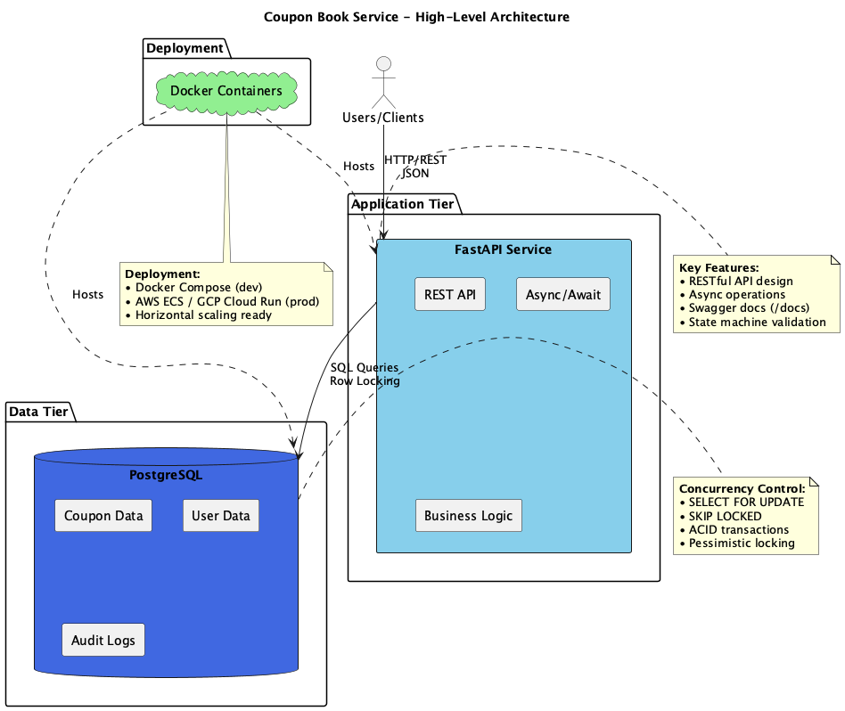
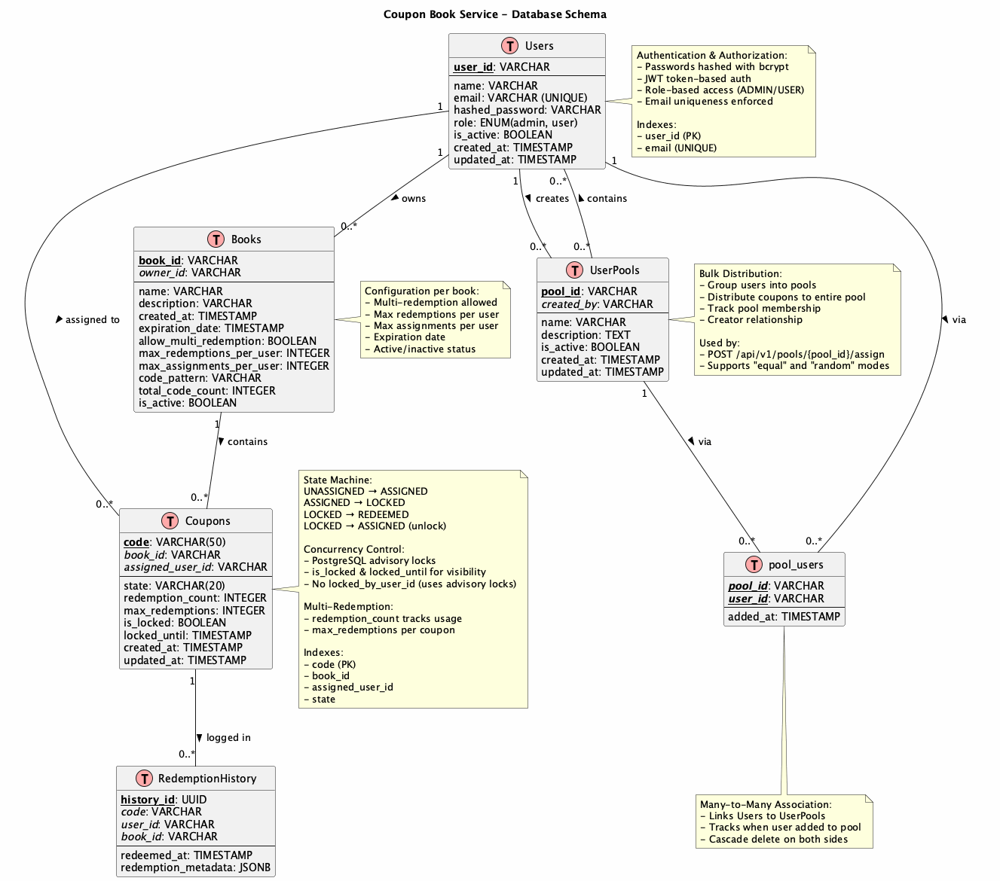
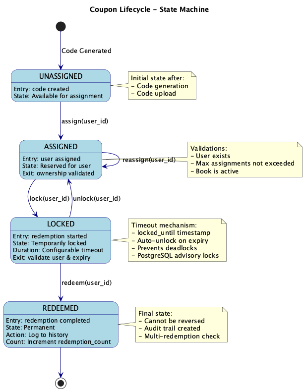
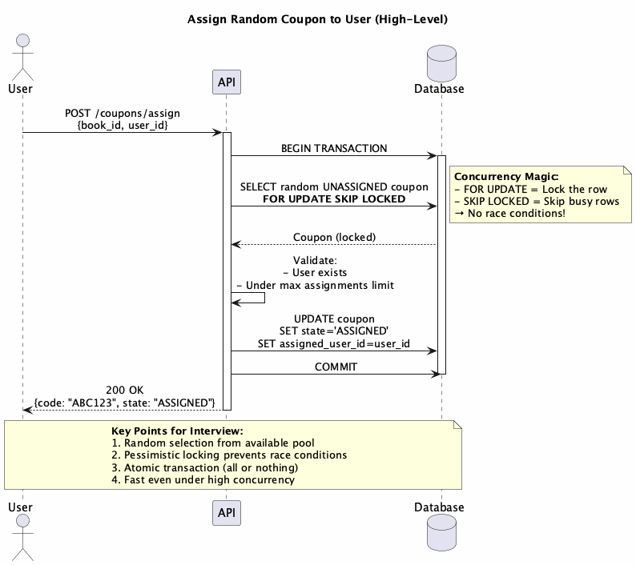
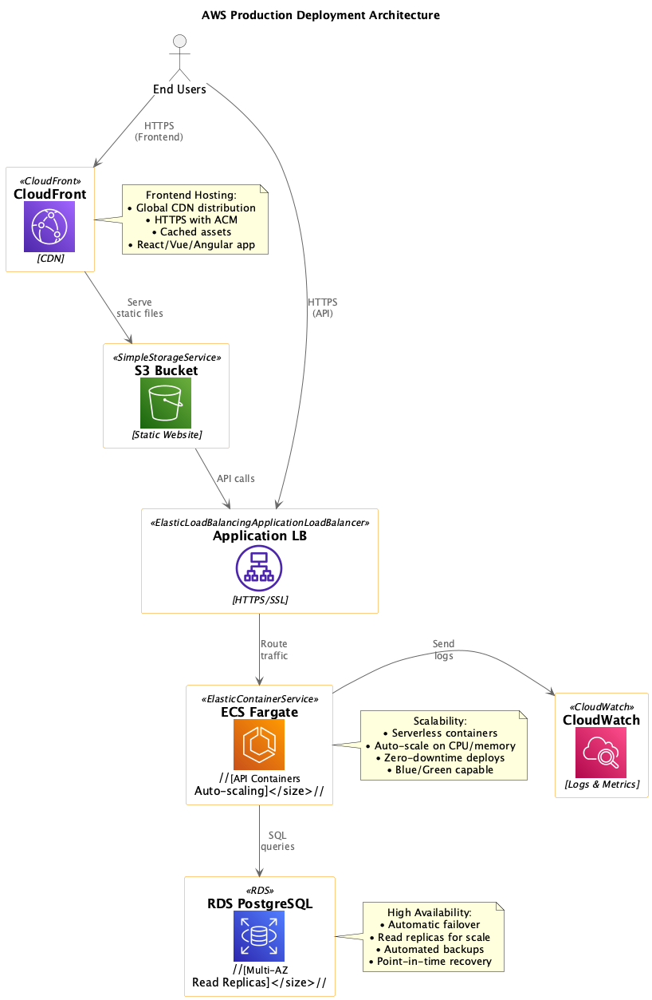
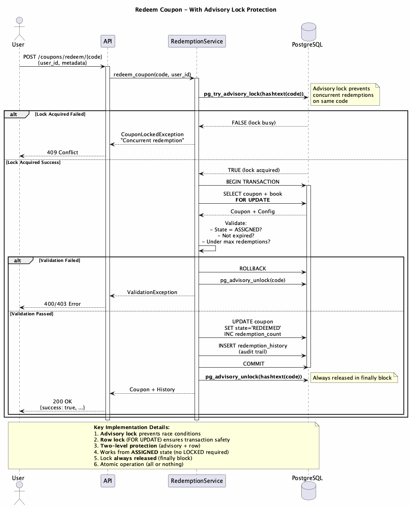

<!-- _class: lead -->

# 🎫 Servicio de Cupones (Coupon Book)

### Implementación Completa del Desafío Técnico

**Desafío**: Diseñar API + Pseudocódigo + Arquitectura  
**Entregado**: Aplicación funcionando completamente

**Construido con**: FastAPI • Vue 3 • PostgreSQL • Docker

---

## 🚀 Preparación para Producción & Opciones de Deployment

### Enfoques de Deployment

**1. Monolítico (Inicio Simple)**
- ECS Fargate o AWS App Runner
- RDS PostgreSQL Multi-AZ
- CloudFront + S3 para frontend
- ✅ Simple, cost-effective, maneja carga significativa

**2. Microservicios (Escala & Equipos)**
- Auth Service + Coupon Service + Redemption Service
- Scaling y deployment independientes
- Comunicación event-driven (SQS/EventBridge)
- ✅ Mejor para organizaciones grandes, equipos independientes

**3. Serverless (Carga Variable)**
- Lambda functions + API Gateway
- Aurora Serverless o DynamoDB
- Auto-scale a cero, pago por request
- ✅ Perfecto para tráfico con picos, ops mínimas

**Adiciones para Producción** (cualquier enfoque):
- Métricas de CloudWatch & tracing con X-Ray
- Secrets Manager para credenciales
- Load Balancer para Rate limiting & protección DDoS
- Backups de database & plan de DR

---

## 📋 Deliverables del Desafío

**1. ✅ Arquitectura del Sistema** (High-Level System Architecture)
- Diseño de 3 capas: Frontend, Backend, Database
- Servicios independientes con deployment-agnostic
- Diagrama completo incluido

**2. ✅ Diseño de Database** (High-Level Database Design)
- 6 tablas con relationships y constraints
- Schema completo con ER diagram

**3. ✅ Endpoints de API** (API Design)
- 6 endpoints requeridos + formatos request/response
- Documentación OpenAPI en `/docs`

**4. ✅ Operaciones Críticas** (3 Implementaciones + Diagramas)
- Assign coupon, Lock coupon, Redeem coupon
- Código real + diagramas de secuencia

**5. ✅ Estrategia de Deployment** (AWS/GCP)
- 3 opciones: Monolítico, Microservicios, Serverless
- Diagrama de AWS incluido

---

## 🏗️ Resumen de Arquitectura



**Diseño de 3 Capas**:
- Frontend: Vue 3 SPA
- Backend: FastAPI con servicios async
- Data: PostgreSQL con connection pooling

**Flexibilidad de Deployment**:
- 📦 **Monolítico**: ECS/App Runner (simple, cost-effective)
- 🔷 **Microservicios**: Auth, coupon y redemption services separados
- ⚡ **Serverless**: Lambda + API Gateway + Aurora Serverless

**Principio Clave**: Stateless, servicios separados, deployment-agnostic

---

## 🗄️ Schema de Database



---

## 📊 Schema de Database (Detalle)

**6 Tablas**:
- **Users**: Autenticación (JWT, bcrypt, roles)
- **Books**: Configuración de coupon books
- **Coupons**: Core del state machine (14 campos)
- **RedemptionHistory**: Audit trail
- **UserPools**: Grupos de distribución bulk
- **pool_users**: Asociación many-to-many

**Highlights de Diseño**:
- Indexes apropiados en foreign keys y estado
- DELETE CASCADE donde corresponde
- JSONB para metadata flexible

---

## 🔄 State Machine



---

## 🔄 State Machine (Explicado)

```
UNASSIGNED → ASSIGNED → LOCKED → REDEEMED
              ↑           ↓
              └───────────┘ (unlock on timeout)
```

**Transiciones Clave**:
- **Assign**: Reclamar un cupón (con validación)
- **Lock**: Preparar para canje (timeout 5 min)
- **Redeem**: Finalizar (permanente, logged)
- **Unlock**: Timeout automático (previene deadlocks)

**Cada transición es validada** - previene todos los edge cases

---

## ✨ Features Clave

### Requeridos (Specs del Desafío)
- 🎲 **Asignación Random** - Con SELECT FOR UPDATE SKIP LOCKED
- ♻️ **Multi-Redención** - Configurable por book
- 🔢 **Max Asignaciones** - Por usuario, por book
- 📤 **Upload/Generación de Códigos** - Upload CSV o basado en pattern
- 🔒 **Mecanismo de Lock** - Lock temporal antes de canjear
- 🔄 **State Machine** - UNASSIGNED → ASSIGNED → LOCKED → REDEEMED

### Bonus (Adiciones de Producción)
- 🔐 **Autenticación JWT** - Acceso basado en roles (ADMIN/USER)
- 🎨 **Frontend Vue 3** - Implementación completa de UI
- 📦 **User Pools** - Distribución bulk (modos equal/random)
- 📝 **Audit Trail** - Historial completo de canjes
- ✅ **Test Suite** - Scripts de validación comprehensivos

**De doc de diseño a producto funcionando** 🚀

---

## ⚡ Solución de Concurrencia

**El Problema**: 1000 usuarios, 100 códigos restantes. Sin duplicados. Sin race conditions.

**La Solución**:
```python
# PostgreSQL advisory locks + SKIP LOCKED
async with session.begin():
    # 1. Adquirir lock a nivel de book (advisory lock)
    await session.execute(text("SELECT pg_advisory_lock(:book_id)"), 
                          {"book_id": book_hash})
    
    # 2. SELECT FOR UPDATE SKIP LOCKED
    coupon = await session.execute(
        select(Coupon)
        .where(Coupon.book_id == book_id, Coupon.state == 'UNASSIGNED')
        .with_for_update(skip_locked=True)
        .limit(1)
    )
    
    # 3. Asignar atómicamente
    coupon.state = 'ASSIGNED'
    coupon.assigned_user_id = user_id
```

---

## 🧪 Demo de Concurrencia



---

## 🎨 Demo del Frontend

### 🛠️ Tech Stack

| Capa | Tecnología | ¿Por qué? |
|-------|-----------|------|
| **Backend** | FastAPI + Python 3.11 | Async/await, docs automáticos, type safety |
| **Database** | PostgreSQL 15 | ACID, advisory locks, row locking |
| **ORM** | SQLAlchemy 2.0 (async) | Patrones async modernos |
| **Frontend** | Vue 3 + Pinia | Reactivo, liviano, moderno |
| **Infraestructura** | Docker Compose | Ambientes consistentes |

**Cada elección fue deliberada** - optimizado para concurrencia, integridad de datos y developer experience.

**¡Momento de Demo en Vivo!** 

**Flujo**:
1. Login como admin
2. Crear un coupon book
3. Upload de códigos (CSV)
4. Distribuir a user pool
5. Cambiar a cuenta de usuario
6. Lockear y canjear cupón

**Features de UX**:
- Notificaciones toast (non-blocking)
- Updates de estado en tiempo real
- Timers de countdown para locks
- Feedback con código de colores

---

## 🚀 Preparación para Producción

**Infraestructura** (Lista para deploy):
- AWS ECS Fargate (backend)
- RDS PostgreSQL Multi-AZ (database)
- CloudFront + S3 (frontend)
- Application Load Balancer

**Aún Necesario**:
- Métricas & logs de CloudWatch
- AWS Secrets Manager
- Rate limiting
- SSL everywhere
- Backups de database
- Plan de disaster recovery

**La parte difícil (business logic) está hecha** ✅

---

## Arquitectura de Deployment en AWS



**Setup de Producción**:
- Backend con auto-scaling
- Database Multi-AZ
- Monitoring con CloudWatch
- Seguridad VPC

---

## 🔌 API Endpoints (Requeridos)

Los 6 endpoints solicitados en el desafío:

| Endpoint | Propósito | Implementación |
|----------|-----------|----------------|
| `POST /coupons` | Crear coupon book | ✅ `/api/v1/books` |
| `POST /coupons/codes` | Upload códigos (CSV) | ✅ `/api/v1/books/{id}/codes/upload` |
| `POST /coupons/assign` | Asignar cupón random | ✅ `/api/v1/coupons/assign/random` |
| `POST /coupons/assign/{code}` | Asignar código específico | ✅ `/api/v1/coupons/assign/{code}` |
| `POST /coupons/lock/{code}` | Lock temporal (5 min) | ✅ `/api/v1/coupons/lock/{code}` |
| `POST /coupons/redeem/{code}` | Canje permanente | ✅ `/api/v1/coupons/redeem/{code}` |

**Documentación completa**: `http://localhost:8000/docs` (OpenAPI/Swagger)

---

## � Implementación: Asignar Cupón Random

```python
# app/services/assignment_service.py (línea 83)
async def assign_random_coupon(
    db: AsyncSession, 
    user_id: int, 
    book_id: int
) -> Coupon:
    # 1. Advisory lock a nivel de book
    book_hash = hash(book_id) % (2**31)
    await db.execute(
        text("SELECT pg_advisory_lock(:id)"), 
        {"id": book_hash}
    )
    
    # 2. SELECT FOR UPDATE SKIP LOCKED
    stmt = (
        select(Coupon)
        .where(
            Coupon.book_id == book_id,
            Coupon.state == CouponState.UNASSIGNED
        )
        .with_for_update(skip_locked=True)
        .limit(1)
    )
    result = await db.execute(stmt)
    coupon = result.scalar_one_or_none()
    
    # 3. Asignar atómicamente
    coupon.state = CouponState.ASSIGNED
    coupon.assigned_user_id = user_id
    coupon.assigned_at = datetime.utcnow()
    
    await db.commit()
    return coupon
```

---

## 🔄 Diagrama: Asignación Random


**Sin race conditions**: SKIP LOCKED + Advisory Locks

---

## � Implementación: Lock Cupón

```python
# app/services/lock_service.py (línea 45)
async def lock_coupon(
    db: AsyncSession,
    user_id: int,
    code: str
) -> Coupon:
    # 1. SELECT FOR UPDATE (ownership validation)
    stmt = (
        select(Coupon)
        .where(Coupon.code == code)
        .with_for_update()
    )
    result = await db.execute(stmt)
    coupon = result.scalar_one_or_none()
    
    # 2. Validaciones
    if coupon.assigned_user_id != user_id:
        raise HTTPException(403, "Not your coupon")
    
    if coupon.state != CouponState.ASSIGNED:
        raise HTTPException(400, "Invalid state")
    
    # 3. Aplicar lock temporal (5 minutos)
    coupon.state = CouponState.LOCKED
    coupon.locked_at = datetime.utcnow()
    coupon.locked_by_user_id = user_id
    coupon.lock_expires_at = (
        datetime.utcnow() + timedelta(minutes=5)
    )
    
    await db.commit()
    return coupon
```

---

## 🔄 Diagrama: Lock Cupón


**Lock temporal**: Previene deadlocks con timeout de 5 minutos

---

## � Implementación: Canjear Cupón

```python
# app/services/redemption_service.py (línea 270)
async def redeem_coupon(
    db: AsyncSession,
    user_id: int,
    code: str
) -> Coupon:
    # 1. SELECT FOR UPDATE
    stmt = (
        select(Coupon)
        .where(Coupon.code == code)
        .with_for_update()
    )
    result = await db.execute(stmt)
    coupon = result.scalar_one_or_none()
    
    # 2. Validar lock ownership y expiración
    if coupon.state != CouponState.LOCKED:
        raise HTTPException(400, "Coupon not locked")
    
    if coupon.locked_by_user_id != user_id:
        raise HTTPException(403, "Lock owned by another")
    
    if coupon.lock_expires_at < datetime.utcnow():
        raise HTTPException(410, "Lock expired")
    
    # 3. Verificar límite de canjes
    book = await db.get(Book, coupon.book_id)
    if not book.allow_multiple_redemptions:
        # Chequear si ya fue canjeado
        stmt = select(RedemptionHistory).where(
            RedemptionHistory.coupon_id == coupon.id
        )
        result = await db.execute(stmt)
        if result.scalar_one_or_none():
            raise HTTPException(400, "Already redeemed")
    
    # 4. Actualizar estado + audit trail
    coupon.state = CouponState.REDEEMED
    coupon.redeemed_at = datetime.utcnow()
    coupon.redemption_count += 1
    
    history = RedemptionHistory(
        coupon_id=coupon.id,
        user_id=user_id,
        redeemed_at=datetime.utcnow()
    )
    db.add(history)
    
    await db.commit()
    return coupon
```

---

## 🔄 Diagrama: Canje de Cupón

## � Diagrama: Canje de Cupón



**Pasos Clave**: Validación + multi-redemption check + audit trail

---

## �🔒 Seguridad & Performance

### Seguridad (Security Considerations)
- **Autenticación**: JWT tokens con expiración
- **Autorización**: Role-based access (ADMIN/USER)
- **Passwords**: Bcrypt hashing (cost factor 12)
- **Input Validation**: Pydantic schemas en todos los endpoints
- **SQL Injection**: Protección via ORM (SQLAlchemy)

### Performance (Performance Considerations)
- **Database**: Connection pooling (asyncpg)
- **Queries**: Indexes en foreign keys y estado
- **Concurrencia**: Advisory locks + SKIP LOCKED
- **Caching**: Potencial para Redis (future improvement)
- **Async/Await**: Non-blocking I/O en todo el backend

---